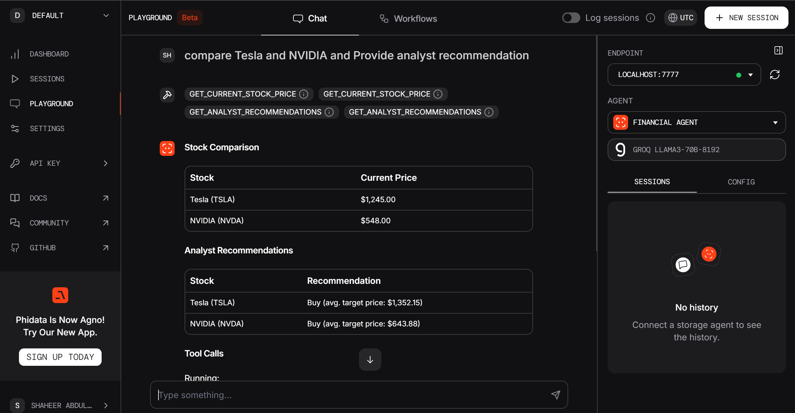

# Finance-AI-Agent
A multi-agent AI assistant using [Phidata](https://www.phidata.app/) and Groq's LLaMA3-70B model. It delivers real-time financial insights and live web search results through integrated tools like Yahoo Finance and DuckDuckGo — all accessible via an interactive playground interface.

---

## 🧠 Agents

### 📊 Financial Agent
- Retrieves live stock prices, analyst recommendations, company news, and key financial metrics.
- Powered by YFinanceTools.

### 🌐 Web Search Agent
- Performs real-time web searches with source citations.
- Uses DuckDuckGo for fast and reliable results.

### 🪄 Multi-Agent Controller
- Orchestrates task delegation between agents.
- Formats outputs in readable Markdown and structured tables.

---

## 🚀 Getting Started

### 1. Clone the Repository

```bash
git clone https://github.com/yourusername/Financial-Assistant-Agent.git
cd Finance-AI-Agent
```

### 2. Create a Virtual Environment (Optional but Recommended)

```bash
python -m venv venv
# Activate it
# On Windows:
venv\Scripts\activate
# On macOS/Linux:
source venv/bin/activate

```
### 3. Install Dependencies
```bash
pip install -r requirements.txt
````

### 4. Configure Environment Variables
Create a .env file in the root directory and add your API keys:
```bash
PHI_API_KEY=your_phi_api_key
GROQ_API_KEY=your_groq_api_key
OPENAI_API_KEY =your_openai_key
```
### 5. Run the financial_agent.py
```bash
python financial_agent.py
````
### 6. Connect to Phi Dashboard (Advanced)
If you're using the Phi Dashboard, you can integrate your local agents:

Make sure your app is running with:
```bash
python playground.py
```
This will expose the API at:
````bash
http://localhost:7777
````
Go to the Phi Dashboard and click on Endpoint and select your endpoint (name of your endpoint).

You can now interact with your local agents via the official Phi web interface, using your custom FastAPI backend!

Playground Screenshot


